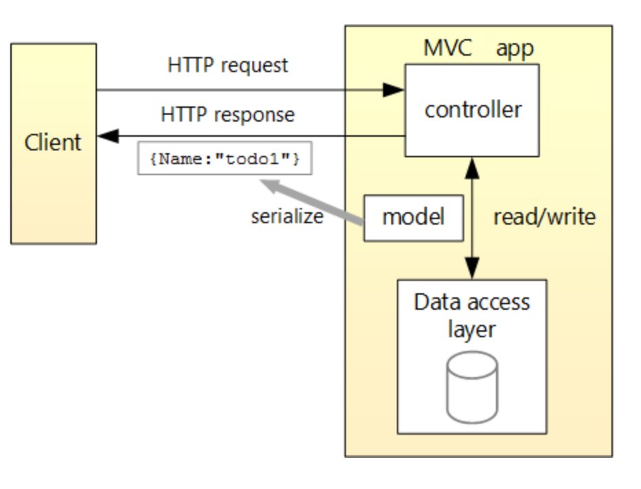

# Todo Web App using Asp.NET Core + React + Typescript

This repository implements a Todo SPA using Asp.NET Core + React + Typescript. Please use the [Todo Starter Kit](https://github.com/sidroopdaska/todo-ts-aspnetmvc-starter) as a starting point and follow the it's associated README.md to reach this final product. This project:

* Implements a *Web API* using Asp.NET Core
* *Stores the data* in an in-memory databse by leveraging the Microsoft Entity Framework for database operations
* Develops the User Interface using React, a popular client-side view library, and,
* Builds the client code using Webpack, a module bundler

## Overview

The diagram below shows basic design of the app.

  

## Prerequisites

* Asp.NET Core SDK (https://www.microsoft.com/net/download/macos)
* Visual Studio 2017 (https://www.microsoft.com/net/download/macos)
* Node.js (https://nodejs.org/en/, download the LTS version)

## Launch the app

* Navigate to the ```Website/``` folder in your terminal. Run:
  * ```npm install``` to import the required node modoules.
  * Following this, execute the npm build script by running```npm start``` in the terminal. This should trigger Webpack which bundles your client side application into a single bundle. Moreover, this script also invokes Webpack in *watch* mode, i.e. any future changes to your client-side source files will re-trigger the bundling process.

* Next, open the ```Todo.sln``` in Visual Studio and hit ```Ctrl + F5``` for Windows or ```Run > Start with Debugging``` for Mac to launch the website.

You should see the browser navigate to ```http://localhost:3001```

**Yay!**


